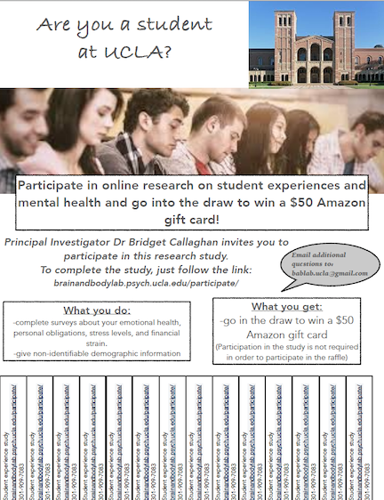

# Methods

## Measures

### Information

| Title        | Name | Description  | Reference  |
| ------------ |--------------- | ------------ | ---------- |
| Demographics | Transfer Mental Health Demographics | Assesses demographic information including student status, racial identification, and school information | Made by BABLab |

### Mental Health

| Title        | Description  | Reference  |
| ------------ |--------------- | ------------ | ---------- |
| bai | Beck Anxiety Inventory | Assesses anxiety through student self-report of anxiety symptoms within the last month | (Beck et al., 1988) |
| dass | Depression Anxiety Stress Scale | Student self-report designed to measure three related negative emotional states: depression, anxiety, and tension/stress | (Lovibond & Lovibond, 1995) |
| pss | Perceived Stress Scale | Assesses how various situations affect perceived stress through self-report of feelings and thoughts over the last month | (Cohen et al., 1983) |
| wemwbs | The Warwick-Edinburgh Mental Wellbeing Scale | Assesses mental well-being through self-report by asking participants to indicate which feelings and thoughts best describe their experiences over the last two weeks |(Tennant et al., 2006) |

### Proposed Risk Factors

| Title        | Description  | Reference  |
| ------------ |--------------- | ------------ | ---------- |
| commuting_status | Commuting Status Questionnaire | Assesses school commute distance, school commute time, and if the  student lives on campus | Made by BABLab |
| imposter_syndrome | Clance Imposter Syndrome Self-Assessment Tool | Assess if the student carries imposter syndrome characteristics and to what extent | (Clance, 1985) |
| dmi | Dweck Mindset Instrument | Assesses if the student has a fixed or growth mindset | (Dweck, 2016) |
| financial_burden | Financial Burden Questionnaire | Assesses to what extent the student feels financially insecure | Made by BABLab |
| familial_obligation | Familial Obligation Questionnaire | Assesses level of familial responsibilities | Made by BABLab |
| transfer_shock | Transfer Shock Questionnaire | Assesses how smooth the student perceives their transition and how prepared they felt for UCLA rigor | Made by BABLab |

### Proposed Resilience Factors

| Title        | Description  | Reference  |
| ------------ |--------------- | ------------ | ---------- |
| grittiness | Angela Duckworth Grit Scale | Assesses passion and perseverance | (Duckworth et al., 2007) |
| mpss | Multidimensional Scale of Perceived Social Support | Assesses feeling of support from family, friends, and significant others | (Zimet et al., 1988) |
| psqi | The Pittsburgh Sleep Quality Index | Assesses quality and patterns of sleep | (Buysse et al., 1989) |
| financial_wellbeing | CFPB Financial Well-Being Scale Questionnaire | Assesses feelings of financial security and concern | (Consumer Financial Protection Bureau) |
| free-time | Free-time Questionnaire | Assesses amount of time student engages in time for themselves and things they enjoy | Made by BABLab |
| dedication | Dedication Questionnaire | Assesses how devoted the student is to their studies and school goals | Made by BABLab |
| caps | Satisfaction with UCLA Counseling and Psychological Services (CAPS) Questionnaire | Assesses use of CAPS, how satisfied they were with the services, and how accessible they feel the services are to the community | Made by BABLab |
| tsp | Satisfaction of UCLA Transfer Student Program (TSP) Questionnaire | Assesses use of TSP, how satisfied they were with the program, possible barriers to attendance and if the program facilitated their transition | Made by BABLab |
| club_involvement | Campus Club Involvement Questionnaire | Assesses feelings of campus connectedness through club involvement and possible barriers to access | Made by BABLab |
| recreational_activities | Use of UCLA Recreational Activities Questionnaire | Assesses utilization of campus recreational facilities and its relationship to feelings of stress | Made by BABLab |

------------------

## Procedure

Students answered surveys anonymously online through RedCap. These surveys assess domains of student experience, as well as potential outside barriers that may inhibit successful transition to UCLA. In addition, the questions ask the participant to document their experiences or use of certain campus resources that may buffer against the relationship between being a transfer student and poor mental health outcomes. The questions also assess the participants’ mental health through a variety of questionnaires which ask about the participants’ thoughts, feelings, and experiences. 

### Questionnaire Order 

1. Demographics
2. Pss
3. Bai
4. Club_involvement  
5. Psqi 
6. Dass
7. Wemwbs
8. Commuting_status 
9. Caps
10. Dedication
11. Dmi 
12. Familial_obligation
13. Financial_burden
14. Financial_well_being
15. Free_time
16. Fsp
17. Tsp
18. Grittiness
19. Imposter_syndrome
20. Perceived_social_support 
21. Recreational_activities
22. Transfer_shock

### Attention Checks

1. Financial_well_being:  
*It is crucial that you are paying full attention to the study. Please tick “Very well"*
2. Perceived_social_support:  
*To ensure that you are giving this study your complete attentiveness, please select “Strongly Agree”*
3. Caps:  
*For this question, please click number 3*
 

### Recruitment

Participants were recruited through one of two methods: For Psychology affiliated students, recruitment occurred through SONA systems, which is an online system used to schedule and manage the UCLA Psychology Department human subject pool. In addition, to obtain data from the wider (non-Psychology) community at UCLA, we also had a non-SONA based version of the questionnaire (using RedCap). The survey was open for the Spring 2020 term, and all survey respondents during those quarters were included in the final analyses.

The following materials were used:

**Flyer:**

**Video Advertisement:**

<iframe width="560" height="315" src="https://www.youtube.com/embed/eAPPBGEviTM" frameborder="0" allow="accelerometer; autoplay; encrypted-media; gyroscope; picture-in-picture" allowfullscreen></iframe>

--------------

